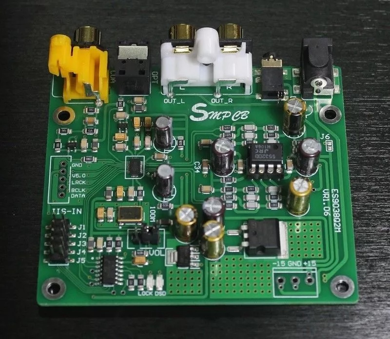
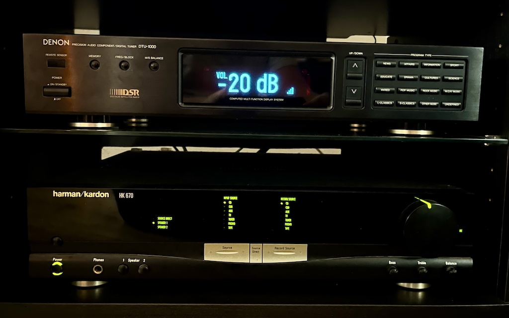

# ESP32-Based DAC Controller with ES9038 Q2M

A DIY high-quality Digital-to-Analog Converter (DAC) project featuring the ES9038 Q2M DAC chip, with volume control and status display. This project repurposes an old Denon digital tuner case to house a modern, WiFi-enabled DAC with MQTT control capabilities.

## Hardware Components

- **DAC**: ES9038 Q2M - High-end 32-bit DAC chip
- **Controller**: ESP32 DEV microcontroller
- **Display**: 256x64 OLED display with SSD1322 controller
- **Volume Control**: Digital potentiometer Microchip MCP41xxx/42xxx
- **Case**: Repurposed Denon digital tuner enclosure

## Features

- WiFi connectivity with OTA (Over-The-Air) update support
- MQTT integration for remote control
- IR remote control compatibility (Sony and Apple remote codes)
- Volume control with dB scaling
- OLED display showing:
  - Current volume level in dB
  - WiFi signal strength
  - Custom text messages via MQTT
- Automatic screen timeout
- Persistent volume settings
- Home Assistant integration ready

## Software Dependencies

- Arduino IDE with ESP32 support
- Required Libraries:
  - `WiFi.h`
  - `ESPmDNS.h`
  - `WiFiUdp.h`
  - `ArduinoOTA.h`
  - `IRremote.hpp`
  - `MCP41xxx.h`
  - `U8g2lib.h`
  - `Wire.h`
  - `MQTT.h`

## Configuration

The device can be configured by modifying the following parameters in the code:

```cpp
struct Config {
    static constexpr const char* HOSTNAME = "ESP32-DAC";
    static constexpr const char* WIFI_SSID = "your_ssid";
    static constexpr const char* WIFI_PASSWORD = "your_password";
    static constexpr const char* MQTT_SERVER = "192.168.x.x";
    // ... other configuration options
};
```

## MQTT Topics

- `/tele/esp-dac/volume/set` - Set volume (0-255)
- `/tele/esp-dac/volume` - Current volume state
- `/tele/esp-dac/display/set` - Set display message

## IR Remote Control

Supports both Sony and Apple remote controls for volume adjustment. The following codes are recognized:
- Sony UP: 0x00004BA5
- Sony DOWN: 0x00004BA4
- Apple UP/DOWN (rolling codes supported)

## Building and Installation

1. Install required libraries in Arduino IDE
2. Configure WiFi and MQTT settings
3. Upload the code to ESP32
4. Connect the hardware components according to the pinout configuration
5. Power up and verify connection

## Hardware Setup

Pin Configuration:
- IR Receiver: PIN 36
- DAC SS: PIN 5
- Display:
  - Clock: 14
  - Data: 12
  - CS: 27
  - DC: 13
  - Reset: 35

## Images


*ES9038 Q2M DAC board used in this project*


*Final assembly in repurposed Denon digital tuner case*

## Usage

1. Power on the device
2. Control volume via:
   - IR remote
   - MQTT commands
   - Home Assistant integration
3. Display messages can be sent via MQTT

## Contributing

Feel free to fork this project and submit improvements via pull requests.

## License

This project is open-source and available under the MIT License.

## Acknowledgments

- ES9038 Q2M DAC design community
- U8g2 library developers
- Arduino and ESP32 communities

## Copyright
© 2025 Martins Ierags. All rights reserved.
This project's code and documentation are protected by copyright law. While the project is open-source, any use, distribution, or modification must retain this copyright notice and provide appropriate attribution to the original author.
